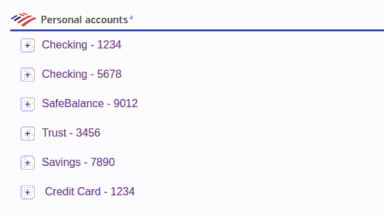

# Account Collapser Extension

This is a lightweight Chrome extension that adds **collapse/expand functionality** to individual account sections on the Bank of America website. It also **remembers your preferences** across page loads using `localStorage`.

## 🔧 Features

- Collapse or expand individual account sections with a single click.
- Collapse state is saved and restored on next visit.
- Designed to be **future-proof** against layout changes — only hides what isn’t essential.
- Clean UI with a toggle button added next to each account name.

## 🖼️ Preview

## 📦 Installation (Development)

1. Clone this repository:

   git clone https://github.com/ronbodnar/account-collapser-extension.git

2. Open Chrome and go to:

   chrome://extensions

3. Enable **Developer Mode** (top right).

4. Click **"Load unpacked"** and select the folder you cloned.

5. Navigate to the Bank of America website and log in to see the extension in action.

## 🔍 How It Works

- Each account section is identified using a unique `data-adx` attribute.
- A `Collapse` button is added to each section.
- When clicked, all extra content inside that section is hidden except:
  - Account name
  - Balance
  - Gripper icon
- The collapsed state is stored in `localStorage` keyed by `data-adx`.

## 📄 License

MIT License — do whatever you want with it.
